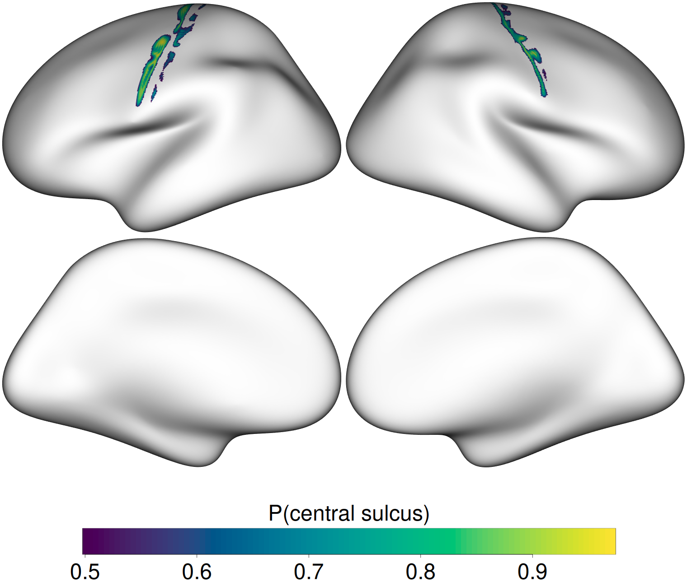

## Why volume-to-surface mapping matters in fMRI

Most fMRI group analyses (SPM, FSL, AFNI) produce statistical maps in a
volumetric atlas space, usually MNI152. Surface-based visualization is more
sensitive and easier to interpret than volume slices: it respects cortical
topology, eliminates partial-volume effects at sulci, and makes group results
directly comparable to parcellation atlases. The bridge between the two worlds
is a *volume-to-surface mapping*.

Here we use the **Registration Fusion** approach of Wu et al. (2018),
implemented in R as `regfusionr::vol_to_fsaverage()`. It projects MNI152
coordinates onto the fsaverage surface and interpolates the volume values at the
resulting surface vertices.

## The test data

Rather than a real statistical contrast, this workflow uses a **central sulcus
probability map** that ships *with the regfusionr package itself* — so it is
versioned with the tool and there is nothing to download:

```{r, eval=FALSE}
probmap_file <- system.file("extdata/testdata",
                            "MNI_probMap_ants.central_sulc.nii.gz",
                            package = "regfusionr")
```

This is a deliberately good ground truth: the peak of the map *must* land on the
central sulcus, i.e. on the posterior bank of the **precentral gyrus** (motor
cortex). Any other location means the mapping parameters (template space,
registration type), the image header, or the vertex indexing is wrong.

## The pipeline

Map the volume to fsaverage (returns per-vertex data for both hemispheres in R):

```{r, eval=FALSE}
suppressMessages({
    library(fsbrain); library(freesurferformats); library(regfusionr)
})
subjects_dir <- Sys.getenv("SUBJECTS_DIR")          # FreeSurfer subjects dir
subject_id   <- "fsaverage"

mapped <- regfusionr::vol_to_fsaverage(probmap_file,
                                       template_type = "MNI152_orig", # space of the input volume
                                       rf_type       = "RF_ANTs",     # registration fusion variant
                                       out_dir       = NULL)          # keep data in R
```

Threshold the probability map and render on the inflated fsaverage surface with
a two-sided symmetric colormap is not needed here — this is a probability map,
so we use a sequential colormap and show only vertices with
P(central sulcus) > 0.5:

```{r, eval=FALSE}
threshold <- 0.5
mapped$lh[mapped$lh < threshold] <- NA
mapped$rh[mapped$rh < threshold] <- NA

cm <- fsbrain::vis.data.on.subject(subjects_dir, subject_id,
                                   morph_data_lh = mapped$lh,
                                   morph_data_rh = mapped$rh,
                                   surface       = "inflated",
                                   views         = NULL,               # build coloredmeshes only
                                   rglactions    = list("no_vis" = TRUE))
fsbrain::export(cm,
                colorbar_legend = "P(central sulcus)",
                output_img      = "figures/mni_central_sulc_t4.png")
```

The full, standalone script is `01_mni_volumetric/run_mni_pipeline.R`.

## Rendered result

{width=100%}

The probability mass hugs the central sulcus on both hemispheres, exactly where
it should be — and the automated validation confirms it quantitatively.

## Anatomical validation

`01_mni_volumetric/run_mni_validation.R` finds the peak-probability vertex in
each hemisphere and looks up its Desikan–Killiany label on fsaverage. The peak
must be **precentral**, **postcentral**, or **paracentral** (the gyri that flank
the central sulcus). Current output:

```text
  lh: peak P(central sulcus)=0.972 at vertex 854   -> DK label 'precentral'  [PASS]
  rh: peak P(central sulcus)=0.939 at vertex 19673 -> DK label 'precentral'  [PASS]
Workflow A validation PASSED.
```

The script exits with status 0 on success and 1 on failure, so it can gate
continuous integration later.

```{r, eval=FALSE}
Rscript run_mni_validation.R
```
