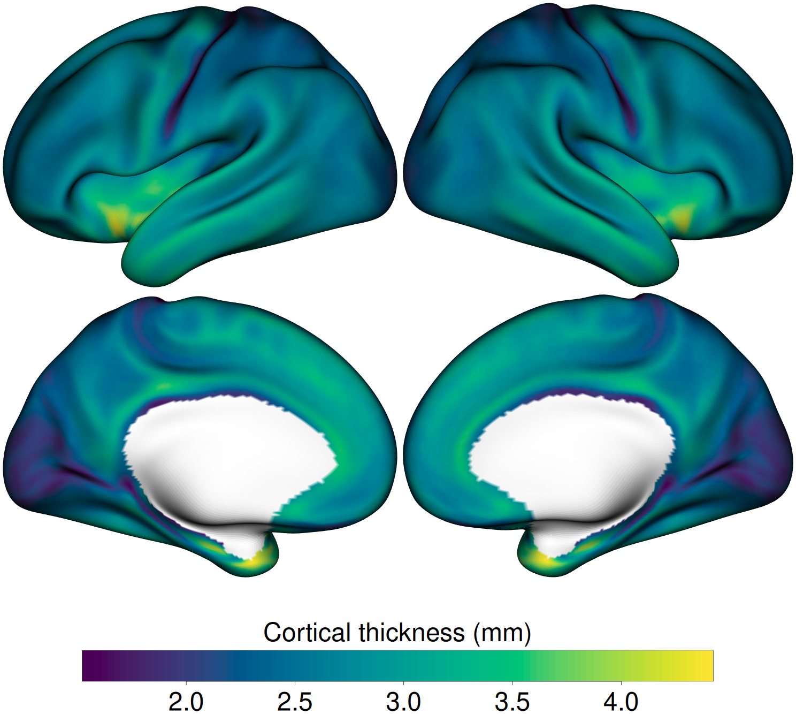

## The shift from fsaverage to grayordinates

Modern pipelines (HCP Pipelines, fMRIPrep with `--cifti-outputs`, ciftify)
increasingly output results in **CIFTI-2 grayordinates** space rather than
per-hemisphere FreeSurfer meshes. The grayordinate representation stores values
for a symmetric cortical atlas called **fs_LR 32k** (32,492 vertices per
hemisphere) plus subcortical structures, all in a single file such as
`*.dscalar.nii` or `*.dtseries.nii`.

Because fs_LR 32k is not a FreeSurfer subject directory, we do not use
`vis.data.on.subject()` here. Instead we read the cortical data straight from
the CIFTI file and render it onto the GIFTI meshes with the *preloaded-mesh*
path in fsbrain.

## The vertex model (read this twice)

A CIFTI-2 file does **not** contain 32,492 values per hemisphere. The cortical
arrays hold only the *valid-cortex* values:

| Hemisphere | values in CIFTI | medial wall (NA) | mesh vertices |
|---|---|---|---|
| left  | 29,696 | 2,796 | 32,492 |
| right | 29,716 | 2,776 | 32,492 |

The CIFTI **BrainModel** block lists the surface vertex index for each value;
those indices scatter the valid-cortex values into the 32,492-vertex mesh, and
all remaining vertices (the medial wall) carry no value.

`freesurferformats::read.fs.morph.cifti()` does exactly this reconstruction: it
returns a full-length per-vertex vector with the medial wall set to `NA` — which
is precisely what fsbrain needs for rendering. This is the single most important
correctness detail of this workflow; getting it wrong is how "index shifting"
bugs happen.

## The test data

The files in `02_cifti_fslr32k/data/` are all from the same source
(DiedrichsenLab fs_LR_32), so they are guaranteed aligned with each other:

- `fs_LR.32k.L/R.inflated.surf.gii` — the symmetric 32k surfaces
- `fs_LR.32k.LR.thickness.dscalar.nii` — cortical thickness (mm), the measure we render
- `fs_LR.32k.LR.sulc.dscalar.nii` — sulcal depth (full mesh coverage)
- `Yeo_JNeurophysiol11_7Networks.32k.{L,R}.label.gii` — Yeo 7-network parcellation (used for validation)

## The pipeline

```{r, eval=FALSE}
suppressMessages({
    library(fsbrain); library(freesurferformats)
})
data_dir <- "02_cifti_fslr32k/data"

# 1. CIFTI -> per-vertex data (medial wall becomes NA)
th_lh <- freesurferformats::read.fs.morph.cifti(
    file.path(data_dir, "fs_LR.32k.LR.thickness.dscalar.nii"), "lh")
th_rh <- freesurferformats::read.fs.morph.cifti(
    file.path(data_dir, "fs_LR.32k.LR.thickness.dscalar.nii"), "rh")

# 2. read the fs_LR 32k meshes
sf_lh <- freesurferformats::read.fs.surface(
    file.path(data_dir, "fs_LR.32k.L.inflated.surf.gii"))
sf_rh <- freesurferformats::read.fs.surface(
    file.path(data_dir, "fs_LR.32k.R.inflated.surf.gii"))

# 3. preloaded-mesh path -> coloredmeshes -> static multi-view figure
cm_lh <- fsbrain::coloredmesh.from.preloaded.data(sf_lh, morph_data = th_lh, hemi = "lh")
cm_rh <- fsbrain::coloredmesh.from.preloaded.data(sf_rh, morph_data = th_rh, hemi = "rh")

fsbrain::export(list("lh" = cm_lh, "rh" = cm_rh),
                colorbar_legend = "Cortical thickness (mm)",
                output_img      = "figures/cifti_thickness_t4.png")
```

The full, standalone script is `02_cifti_fslr32k/run_cifti_pipeline.R`.

## Rendered result

{width=100%}

Cortical thickness is highest in the sensorimotor and medial temporal regions;
the medial wall is masked out (no values), exactly as it should be.

## Ground-truth validation

`02_cifti_fslr32k/run_cifti_validation.R` checks two things:

1. **Mapping correctness** — the reconstructed vectors match the mesh vertex
   counts (32,492 per hemisphere), and the total number of cortical vertices
   (left + right) equals the standard fs_LR 32k count of **59,412**. Any index
   shifting or polar inversion would break these numbers.
2. **Anatomical sanity** — the peak of the thickness map must land in the
   thickest-cortex region (medial temporal cortex / temporal pole = Yeo
   7-network **Limbic**, key 5).

Current output:

```text
  lh: data length 32492 == mesh vertices 32492  [PASS]
  rh: data length 32492 == mesh vertices 32492  [PASS]
  total cortical vertices (L+R): 59412 == expected 59412  [PASS]
  lh: peak thickness 4.274 mm at vertex 26396 -> Yeo network key 5 ('7Networks_5')  [PASS]
  rh: peak thickness 4.408 mm at vertex 26395 -> Yeo network key 5 ('7Networks_5')  [PASS]
Workflow B validation PASSED.
```

The script exits with status 0 on success and 1 on failure.

```{r, eval=FALSE}
Rscript run_cifti_validation.R
```
