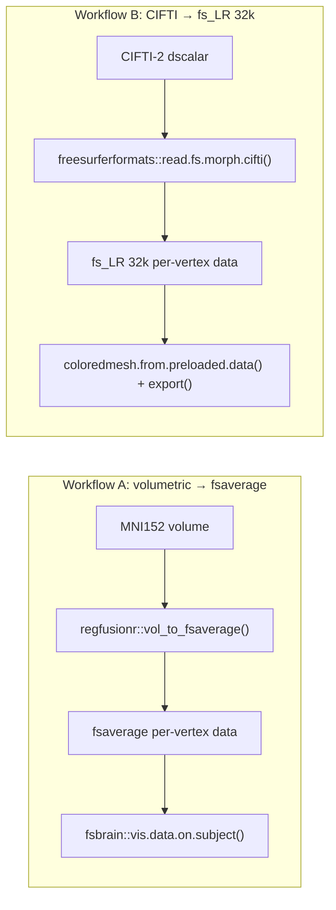

This site demonstrates how to visualize functional MRI (fMRI) results on the
cortical surface with [fsbrain](https://github.com/dfsp-spirit/fsbrain) in pure
R, and how to **validate** that coordinate transformations, hemisphere
alignments, and surface index mappings match established anatomical
topographies.

The repository serves two purposes:

1. **Showcase / tutorial** — a guided walkthrough of the two dominant ways fMRI
   researchers plot statistical results on the surface.
2. **Ground-truth validation** — each workflow ships an automated script that
   asserts the result lands where it anatomically must.

## The two core workflows

| | **Workflow A** | **Workflow B** |
|---|---|---|
| **Input** | Volumetric MNI152 map | CIFTI-2 grayordinates (`.dscalar.nii`) |
| **Typical source** | Group-level GLM / contrast (SPM, FSL, AFNI) | HCP-style pipelines (fMRIPrep, HCP Pipelines, ciftify) |
| **Target mesh** | fsaverage (FreeSurfer) | fs_LR 32k (HCP grayordinates) |
| **Bridging tool** | `regfusionr::vol_to_fsaverage()` (Wu et al., 2018) | `freesurferformats::read.fs.morph.cifti()` |
| **Rendering** | `fsbrain::vis.data.on.subject()` | `coloredmesh.from.preloaded.data()` + `export()` |
| **Tutorial** | [Workflow A](01_mni_volumetric/workflow_mni.qmd) | [Workflow B](02_cifti_fslr32k/workflow_cifti.qmd) |
| **Validation script** | `01_mni_volumetric/run_mni_validation.R` | `02_cifti_fslr32k/run_cifti_validation.R` |

## Pipeline comparison



## Gallery

{width=100%}

{width=100%}

## Reproducing the figures

All scripts are standalone and documented in the [README](README.md). They run
from the repository root:

```sh
# Workflow A
Rscript 01_mni_volumetric/run_mni_pipeline.R
Rscript 01_mni_volumetric/run_mni_validation.R

# Workflow B
Rscript 02_cifti_fslr32k/run_cifti_pipeline.R
Rscript 02_cifti_fslr32k/run_cifti_validation.R
```
